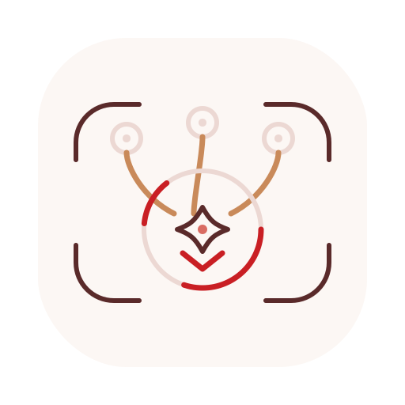
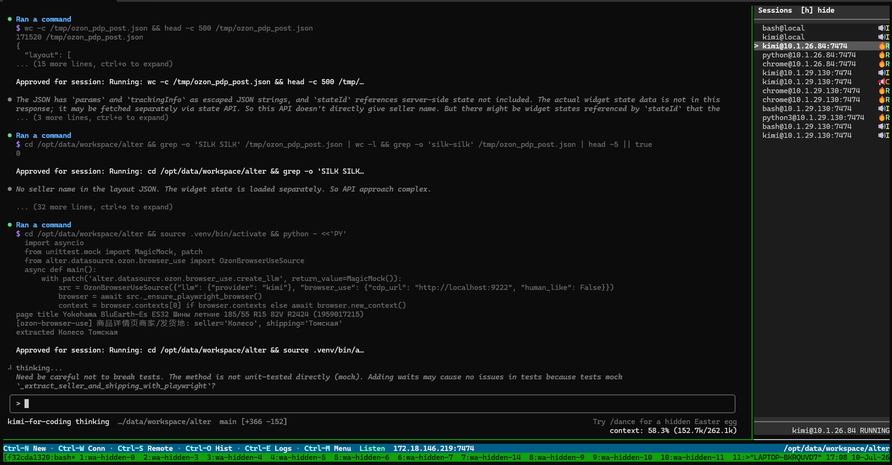

<div align="center">

<p align="center">
  
</p>

<h1>WaitAgent: One Terminal Workspace for Local and Remote AI Agents</h1>

<p>
Run Claude Code, Codex CLI, Kimi, shells, and remote machine sessions from one
tmux-native workspace. Keep one active input surface, one session sidebar, and
one workflow for the agents you already use in terminals.
</p>

<p align="center">
  <a href="https://github.com/kikakkz/wait-agent/actions/workflows/ci.yaml?branch=main"></a>
  <a href="https://github.com/kikakkz/wait-agent/releases"></a>
  <a href="#license"></a>
  <a href="https://www.rust-lang.org"></a>
  <a href="https://github.com/tmux/tmux"></a>
</p>

<p align="center">
  <strong>
    <a href="#install">Install</a> ·
    <a href="#quick-start">Quick Start</a> ·
    <a href="#remote-machines">Remote Machines</a> ·
    <a href="#how-waitagent-works">How It Works</a> ·
    <a href="#documentation">Docs</a>
  </strong>
</p>

<p align="center">
  
</p>

</div>

---

> Public Alpha: local workflows are usable, and remote multi-machine workflows
> are implemented and actively hardening. Expect rapid iteration around
> reconnects, agent state detection, and remote security boundaries.

---

## Table of Contents

- [Why WaitAgent?](#why-waitagent)
- [Install](#install)
- [Quick Start](#quick-start)
- [Remote Machines](#remote-machines)
- [How WaitAgent Works](#how-waitagent-works)
- [Capabilities](#capabilities)
- [Status](#status)
- [Security](#security)
- [Compared With Other Tools](#compared-with-other-tools)
- [Supported Platforms](#supported-platforms)
- [Documentation](#documentation)
- [License](#license)

---

## Why WaitAgent?

Coding agents are easiest to adopt as terminal tools, but running several of
them quickly becomes messy:

- one Codex session is waiting for input
- one Kimi session is still running
- one Claude Code session is asking for confirmation
- a remote machine has the shell you need
- tmux panes keep multiplying until it is unclear where input will go

WaitAgent adds the missing coordination layer underneath those agents:

- a catalog of local and remote terminal sessions
- task-state badges for input, running, confirm, and unknown states
- one stable main slot that receives input
- remote discovery, switching, resize, output, and session creation
- tmux as the terminal substrate instead of a custom terminal replacement

The goal is not to become an IDE or agent platform. WaitAgent is terminal
infrastructure for developers who already live in tmux, SSH, shells, and CLI
agents.

---

## Install

One-line install for Linux x86_64 and macOS Apple Silicon:

```bash
curl -fsSL https://raw.githubusercontent.com/kikakkz/wait-agent/main/scripts/install.sh | bash
```

The installer resolves the latest GitHub release tag and downloads the matching
release artifact. It does not build from `main`.

Manual downloads are available from the
[GitHub releases page](https://github.com/kikakkz/wait-agent/releases).

<details>
<summary><strong>Windows / WSL2</strong></summary>

<br>

WaitAgent does not run as a native Windows binary yet. Install and run the Linux
build inside WSL2:

```bash
curl -fsSL https://raw.githubusercontent.com/kikakkz/wait-agent/main/scripts/install.sh | bash
```

When the WSL2 workspace needs to accept remote-machine connections, start
WaitAgent with a public endpoint that remote hosts can dial:

```bash
waitagent --public <windows-or-lan-ip>:7474
```

If WSL2 mirrored networking is not reliable in your environment, use Windows NAT
plus a port proxy from the Windows host to the WSL2 address. Run this in an
elevated Windows PowerShell or Command Prompt:

```powershell
netsh interface portproxy add v4tov4 listenaddress=0.0.0.0 listenport=7474 connectaddress=<wsl2-ip> connectport=7474
```

Then launch WaitAgent inside WSL2 with the Windows/LAN address remote machines
can reach:

```bash
waitagent --public <windows-or-lan-ip>:7474
```

</details>

<details>
<summary><strong>Build from source</strong></summary>

<br>

```bash
git clone --recursive https://github.com/kikakkz/wait-agent
cd wait-agent
./scripts/install-build-deps.sh
cargo build --release
```

</details>

---

## Quick Start

Start a local workspace:

```bash
waitagent
```

Inside the workspace:

```text
Ctrl-N  new local session
Ctrl-W  connect a remote host
Ctrl-S  new session on the selected remote endpoint
Ctrl-O  main-slot history
Ctrl-E  logs
Ctrl-M  menu
```

CLI helpers:

```bash
waitagent ls
waitagent attach <target>
waitagent detach
waitagent stop <target>
waitagent cleanup
```

Task badges:

| Badge | Meaning |
|---|---|
| `I` | waiting for input |
| `R` | running |
| `C` | waiting for confirmation |
| `U` | unknown |

---

## Remote Machines

WaitAgent can aggregate sessions from remote machines into the same local
sidebar.

Start a listener on the machine with the UI. The `--public` value must be an
address that remote machines can reach:

```bash
waitagent --public <reachable-ip>:7474
```

Then use `Ctrl-W` in the UI to connect a remote host over SSH. The connector can:

- install or update `waitagent` on the remote host
- start the remote daemon
- connect the remote node back to the local listener
- show remote sessions in the same sidebar
- create new remote sessions with `Ctrl-S`

Direct connection is also available:

```bash
waitagent --connect <server-ip>:7474
```

Windows users should install and run WaitAgent inside WSL2. If the remote host
cannot reach WSL2 directly, expose the listener through Windows NAT; see
[Windows / WSL2](#windows--wsl2).

---

## How WaitAgent Works

WaitAgent embeds a vendored tmux and builds one persistent workspace out of real
tmux panes.

```text
┌──────────────────────────────────────────────────────┬──────────────────────┐
│ Main Slot                                            │ Sessions             │
│ Active local or remote PTY                           │──────────────────────│
│                                                      │ > codex@local     I  │
│ - shell, Claude Code, Codex CLI, Kimi, or any TUI    │ * kimi@remote     R  │
│ - raw input/output/resize stay tied to one target    │   bash@remote     U  │
│ - remote targets render through a live mirror        │                      │
├──────────────────────────────────────────────────────┴──────────────────────┤
│ Ctrl-N New · Ctrl-W Conn · Ctrl-S Remote · Ctrl-O Hist · Ctrl-M Menu        │
└─────────────────────────────────────────────────────────────────────────────┘
```

Core pieces:

| Component | Role |
|---|---|
| **Main Slot** | The only surface that receives normal input. |
| **Sidebar** | Local and remote session catalog with task-state badges. |
| **Footer** | Commands, listener/connect state, and workspace path. |
| **Target hosts** | Real tmux sessions running agents or shells. |
| **Remote nodes** | gRPC-connected peers that publish catalogs and PTY traffic. |
| **Live mirror** | Session-scoped rendering path for remote PTYs. |

Switching a sidebar item rebinds the main slot. Sidebar and footer stay mounted,
so the workspace remains stable while the active PTY changes.

---

## Capabilities

| Capability | Current behavior |
|---|---|
| **Local agent workspace** | Run many shell, Codex, Claude, Kimi, or generic terminal sessions from one tmux workspace. |
| **Remote session catalog** | Connect remote machines and show their sessions next to local sessions. |
| **Single input authority** | Only the active main-slot target receives normal keystrokes. |
| **Agent state badges** | Detect input, running, confirm, and unknown states for common CLI agents. |
| **Remote bootstrap** | SSH install/update/start flow from the UI, with saved hosts and proxy profiles. |
| **Remote session creation** | Create a new session on the selected remote endpoint with `Ctrl-S`. |
| **History/fullscreen** | Inspect main-slot history or focus the active target without changing the workspace model. |
| **Local binary** | One Rust binary, no account, no hosted control plane. |

---

## Status

Works today:

- Linux x86_64 release artifacts: `.tar.gz`, `.deb`, `.rpm`
- macOS Apple Silicon release artifacts: `.tar.gz`, `.dmg`
- WSL2 through the Linux build
- local tmux-backed workspace with fixed main slot, sidebar, and footer
- local session create/switch/attach/detach/stop
- main-slot fullscreen and history view
- task-state badges for Codex, Claude, Kimi, shell, and unknown sessions
- `waitagent --public` listener and `waitagent --connect` remote node
- `Ctrl-W` SSH remote-host bootstrap
- `Ctrl-S` new session on selected remote endpoint
- remote input/output/resize path
- remote session exit synchronization
- reconnect handling for common network interruptions

Still hardening:

- long-running remote reconnect edge cases
- broader agent-specific TUI state detection
- Linux aarch64 release artifacts
- remote security model for untrusted networks
- automatic handling rules for session/task states

Planned:

- per-item automatic handling rules
- richer session switch lists for Codex, Claude, Kimi, and similar CLI agents
- WeChat and Telegram connection support

---

## Security

WaitAgent is currently intended for trusted machines on a trusted LAN, VPN,
private network, or similarly controlled environment.

- Remote host bootstrap uses SSH.
- Remote runtime transport is gRPC-based.
- Connected remote nodes should be treated as trusted peers.
- Saved host and proxy profiles are local machine state, not a managed secret
  store.
- Do not expose the WaitAgent listener directly to the public Internet unless
  you understand and accept the trust boundary.

If you need public-Internet access, put WaitAgent behind your own network
controls first.

---

## Compared With Other Tools

| Tool | What it is | Where WaitAgent differs |
|---|---|---|
| tmux / Zellij | Terminal multiplexers | WaitAgent adds local/remote session cataloging, agent state badges, and a fixed main-slot workflow. |
| SSH + tmux manually | Flexible remote workflow | WaitAgent automates discovery, bootstrap, switching, resize, and focus discipline across machines. |
| Warp | Full terminal/agentic IDE product | WaitAgent is a local terminal-native binary with no account and no hosted platform. |
| Cursor / Codex App | IDE or app-level agent surface | WaitAgent sits underneath CLI agents and keeps the terminal workflow. |

---

## Supported Platforms

| Platform | Status |
|---|---|
| Linux x86_64 | Primary target; release artifacts available |
| macOS Apple Silicon | Release artifacts available |
| Windows | Use WSL2 Linux build |
| Linux aarch64 | Source build expected; release artifact not currently published |
| Intel macOS | Source build may work; release artifact not currently published |

Source builds need Rust plus the dependencies required for the vendored tmux
build. `./scripts/install-build-deps.sh` supports Debian/Ubuntu, Fedora,
Arch/Manjaro, Alpine, openSUSE/SLES, and Homebrew.

---

## Documentation

- [Architecture](docs/architecture.md)
- [Functional Design](docs/functional-design.md)
- [Remote Node Connection Architecture](docs/remote-node-connection-architecture.md)
- [Remote Live Mirror Design](docs/remote-live-mirror-design.md)
- [Remote Transport Stability Design](docs/remote-transport-stability-design.md)
- [Protocol](docs/protocol.md)
- [Interaction Flows](docs/interaction-flows.md)
- [UI Design](docs/ui-design.md)
- [Execution Status Board](docs/execution-status-board.md)

---

## Topics

`tmux` `terminal-multiplexer` `workspace-manager` `terminal` `rust` `cli`
`tui` `multi-agent` `ai-agents` `multi-machine` `session-manager` `grpc`

## License

MIT
